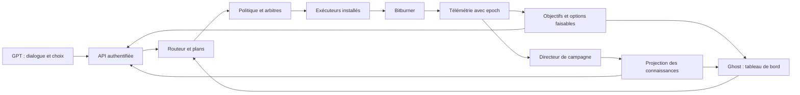

# Contrat de jeu · RP BN4 version 1

## Promesse de la version jouable

Après certification, un parcours BN4 hacking/augmentations complet doit pouvoir se jouer avec des décisions, sans édition JS, console de développeur, modification manuelle de fichiers ou ajout d'un exécuteur au milieu d'une scène. La reconstruction après installation d'augmentations appartient à ce même parcours.

La cible n'est pas « toutes les mécaniques de tous les BitNodes pour toujours ». C'est une version de jeu finie, avec un domaine documenté, des capacités testées et des extensions facultatives. Un changement de Bitburner peut nécessiter de la maintenance entre les sessions. Corporation, Bladeburner, Grafting, Darknet et autres voies n'interviennent dans une mission jouable que si leur paquet est certifié. La société antagoniste de la fiction ne doit pas obliger à posséder sa propre corporation.

## Un seul moteur, plusieurs interfaces

Le GPT interprète l'intention. Le moteur choisit et poursuit les sous-tâches pendant son absence. Le directeur déclenche des scènes à partir de faits et de choix enregistrés. Les activités qui se disputent le joueur, la RAM ou l'argent passent par des arbitres communs. La console et le GPT soumettent le même type de requête.

## Le briefing « Alors, les nouvelles ? »

Le serveur fournit un paquet cohérent `briefing` : `snapshotId`, `resetEpoch`, `observedAt`, `fresh`, `objective`, `blockers`, `changesSinceCursor`, `availablePlans`, `publishedScene`, `nextCursor`. Le GPT ne recalcule pas le progrès à partir de prose.

`objective` contient `id`, `revision`, `scope`, `label`, `metric`, `current`, `required`, `progressPct`, `evidenceIds`, `eta` nullable. Un compteur de revenu théorique ne remplace pas le revenu observé. Une ETA indique fenêtre, taux et incertitude; cash non monotone ou aucun progrès ⇒ ETA inconnue.

Pour un objectif simple, `progressPct = clamp(100 * current / required, 0, 100)` uniquement avec des observations finies, fraîches, du même epoch et `required > 0`. Objectif absent ou dénominateur inconnu ⇒ null. Pour une feuille de route composée : somme pondérée de jalons **définis avant mesure**, poids positifs versionnés; publier les composantes et les inconnues, sans renormaliser pour les cacher. Ce score mesure la feuille de route déclarée, jamais un « vrai pourcentage natif du BitNode ».

Trois progressions peuvent coexister et restent nommées : objectif opérationnel, feuille de route BN4, chapitre narratif. Elles ne se substituent pas l'une à l'autre. Le système peut dire « 40 % de notre objectif de réputation », mais pas « 40 % du node » sur la base de ce seul chiffre.

## Exemple de rendu cible, entièrement fictif

> Notre objectif de réputation est à 40 % : 100 000 sur 250 000. Les revenus financent la suite, mais la réputation nous ralentit. Dans la campagne, X tente de fermer nos relais. Trois voies restent ouvertes : renforcer le partage pendant deux minutes, donner priorité au travail de faction, ou garder la stratégie actuelle et différer l'opération.

Ce texte est un exemple d'interface, pas une mesure de la partie. Chaque option correspond à un `planId` réel et frais. Le serveur fournit ses coûts maximums, effet attendu, conflits, durée estimée, classe de confirmation, expiration et raisons d'indisponibilité. Une option disparue entre lecture et choix est rejetée avec un nouveau briefing, sans action de remplacement silencieuse.

L'IA peut proposer un plan composite, par exemple rejoindre une faction : trajet → prérequis → backdoor → invitation → travail → achat. Il est enregistré et repris étape par étape. Elle ne doit pas présenter six appels techniques au joueur pour une seule intention.

## Les antagonistes et leurs effets

Une pression de X peut être : un obstacle réel constaté, une interprétation incertaine, ou un événement de campagne. Toute proposition garde cette provenance en données; une touche diégétique peut la présenter naturellement. Si le jeu n'a pas de mécanique de sabotage associée, la campagne ne prétend pas qu'un sabotage natif a été constaté.

Les effets narratifs passent par des opérateurs déclaratifs bornés : `flag.set`, `reputation.adjust` (réputation **de campagne**), `clue.publish`, `scene.unlock`, `objective.offer`. Aucun ne modifie le cash, les compétences ou la réputation native du jeu. Une conséquence opérationnelle exige un `planId` issu du routeur et une autorisation de jeu distincte. Attendre ou refuser demeure possible; pas de script à écrire pour sortir d'une branche narrative.

## Politique de contrôle

Routine dans une enveloppe accordée : changer une priorité, affecter la RAM libre, lancer un boost borné, poursuivre une route validée. Les décisions majeures comme installation d'augmentations ou destruction du BitNode exigent un plan figé et l'autorisation liée à son empreinte. L'utilisateur pourra choisir plus tard une politique persistante explicite pour les resets; aucune ne découle d'une réplique fictionnelle.

Une requête transporte `requestId`, `idempotencyKey`, `resetEpoch`, `policyRevision`, `planId`, `planRevision`, `expiresAt`. Un reçu passe par `accepted → running → succeeded|failed|cancelled|expired|outcome-unknown`. Le même identifiant renvoie le même travail; même clé et payload différent ⇒ conflit. `succeeded` exige une postcondition observée, jamais seulement un PID non nul.

Le journal append-only garde l'intention, les réservations, la phase avant effet, l'effet vérifié et la projection publiée. Après crash entre effet et reçu, réconcilier avec le jeu; à défaut, `outcome-unknown` bloque toute répétition destructive. Les anciens ordres ne traversent pas un reset. Les plans durables sont replanifiés dans le nouvel epoch avec les droits encore valides.

Pause veut dire : fermer l'admission, laisser finir ou annuler uniquement les travaux possédés selon leur politique, réconcilier les activités persistantes puis publier `paused` lorsque les postconditions sont vraies. Avant cela, `draining` ou `partially-paused`, avec les tâches restantes. Un `masterEnabled=false` écrit ne suffit pas.

## Continuité et silence du GPT

Le moteur local assure les tâches continues. L'architecture ne dépend pas d'un GPT qui se réveille spontanément ou reste dans une boucle d'appels. À la prochaine question, les événements depuis le curseur produisent les nouvelles. En cas de trou de rétention : snapshot complet + mention du trou; aucune histoire inventée pour le combler.

La campagne reste en préparation tant que BN1→BN4 n'est pas observé. La première ouverture reçoit un identifiant, une condition et un acquittement durable. Une nouvelle conversation recharge la projection joueur; elle ne reçoit ni le coffre GM ni un résumé contenant ses révélations futures.

## Limites techniques du transport GPT

Les Actions imposent HTTPS, une réponse sous 45 secondes et des payloads inférieurs à 100 000 caractères; les travaux longs doivent retourner un identifiant puis être consultés. Garder l'idempotence dans le JSON, les headers personnalisés n'étant pas pris en charge. Marquer séparément les opérations conséquentes qui nécessitent confirmation. Source vérifiée : [documentation officielle Actions](https://developers.openai.com/api/docs/actions/production).

Le schéma historique est un brouillon. Le futur gateway devra publier seulement les ordres réellement installés, autorisés et testés. Le Remote File API du jeu transporte les fichiers; un exécuteur Netscript installé reste nécessaire pour agir. Un seul composant possède la connexion au jeu. Auditer et réutiliser le pont existant avant de lancer un deuxième serveur concurrent.
